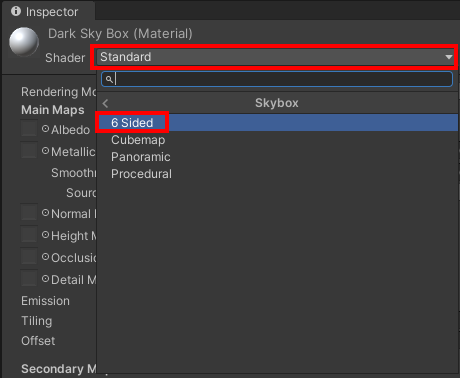
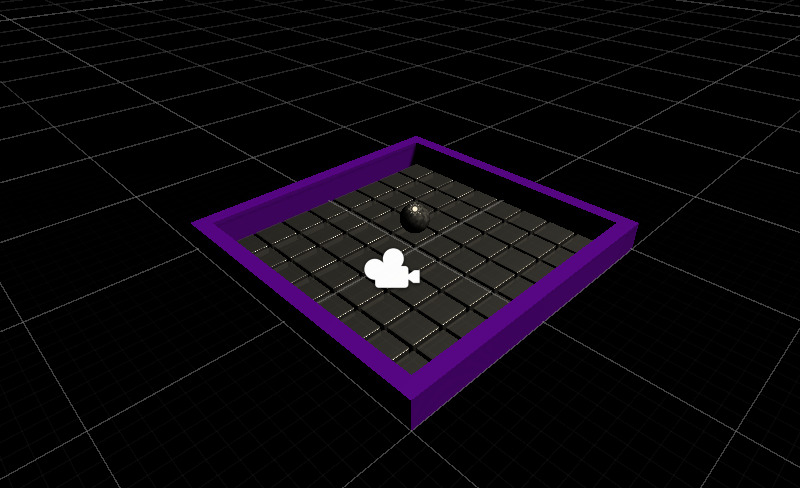

In the Project window, go to the Materials folder. Add a new material and give it a name.

With the new material selected. Go to the Inspector window.

Change the 'Shader' to **Skybox > 6 Sided**.

Change the 'Tint Color' to your chosen colour by moving the R, G, B sliders. 

Drag the new skybox from the Materials folder onto the background of your scene. 

Your scene will change based on the colour that you have chosen. 

